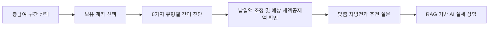
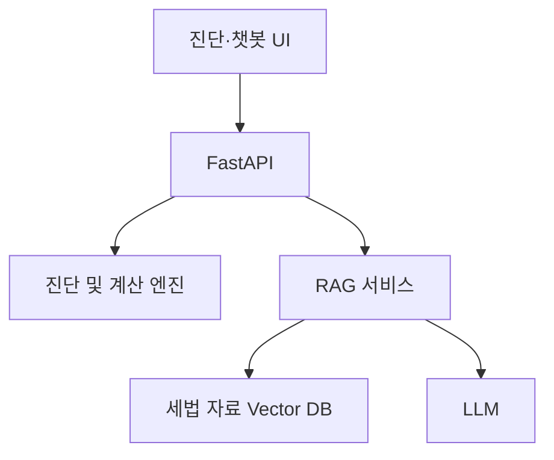

# 연금 연말정산 환급금 수색대

> "총급여 구간과 보유 계좌"만 선택하면 연금계좌 세액공제 여력을 진단하고,
> 다음 절세 행동과 관련 개념을 대화형으로 안내하는 AI 절세 비서
> RAG를 활용한 연말정산 챗봇과 함께 구현 

**팀 노후지키미**가 개발 중인 연말정산 고객 Q&A 챗봇 MVP입니다.

## 프로젝트 소개

연말정산을 준비하는 많은 사용자는 세법 용어가 어렵고 정보가 여러 곳에 흩어져 있어, 무엇을 확인하고 질문해야 하는지부터 막막함을 느낍니다.

이 프로젝트는 주민등록번호나 계좌번호 같은 민감정보 없이 아래 두 가지 정보만으로 사용자의 연금 세액공제 상태를 빠르게 진단합니다.

1. 총급여가 5,500만 원 이하인지
2. 연금계좌와 ISA를 보유하고 있는지

진단 결과에서는 예상 세액공제액과 남은 납입 여력을 보여주고, 사용자의 상황에 맞는 추천 질문을 제공해 자연스럽게 연말정산 AI 챗봇 상담으로 이어지도록 설계합니다.

## 핵심 UX 전략

이 서비스의 핵심은 계산 결과만 보여주는 것이 아니라, 
**간이 진단 리포트로 사용자의 호기심을 이끌어 대화창에서 실제 상황을 더 이야기하도록 돕는 것**입니다.

1. **진단으로 시작**: 두 가지 선택만으로 빠르게 나의 공제율과 연금계좌 상태를 확인합니다.
2. **숫자로 이해**: 슬라이더를 움직이며 추가 납입액에 따른 예상 세액공제 효과를 확인합니다.
3. **대화로 확장**: 진단 결과에 맞는 추천 질문을 선택하거나 월세, 부양가족, 이직 등 실제 상황을 자유롭게 질문합니다.
4. **근거와 행동 제시**: 챗봇은 적용 조건, 계산 과정, 필요한 서류와 공식 출처를 함께 안내합니다.

사용자는 세법 용어를 미리 알지 못해도 진단에서 상담까지 자연스럽게 이동하고, “나에게 맞춘 전담 상담”처럼 이어지는 경험을 얻을 수 있습니다.

## 해결하려는 문제

- **질문 진입장벽**: 세법을 잘 모르면 챗봇에 무엇을 물어봐야 하는지도 알기 어렵습니다.
- **정보의 파편화**: 연금저축·IRP·ISA 관련 정보가 개정이 되다보니, 옛날 정보들이 혼재되어 있습니다.
- **개인화 부족**: 일반적인 설명을 해주는 연말정산 AI 챗봇은 존재합니다. 하지만 이를 통해선 내가 얼마를 더 납입하고 어떤 혜택을 기대할 수 있는지 알기 어렵습니다.
- **민감정보 입력 부담**: 정교한 계산을 위해 개인정보나 금융정보를 과도하게 요구하는 서비스는 이용 장벽이 높습니다.

## 핵심 사용자 흐름



### 1. 두 가지 정보 입력

| 입력 | 코드 | 선택지 |
| --- | --- | --- |
| 총급여 구간 | `Q1_salary` | `UNDER_55M` / `OVER_55M` |
| 보유 계좌 | `Q2_account` | `BOTH` / `PENSION_ONLY` / `ISA_ONLY` / `NONE` |

### 2. 유형별 간이 진단

| 총급여 | 보유 계좌 | 적용 예상 공제 효과율¹ | 핵심 안내 |
| --- | --- | ---: | --- |
| 5,500만 원 이하 | 연금계좌 + ISA | 16.5% | 연금계좌 납입 여력과 ISA 만기자금 전환 혜택 안내 |
| 5,500만 원 이하 | 연금계좌만 | 16.5% | 연금저축·IRP 합산 한도와 예상 세액공제액 안내 |
| 5,500만 원 이하 | ISA만 | 16.5% | ISA 자체는 연금계좌 세액공제 대상이 아니며, 만기자금 전환 조건 안내 |
| 5,500만 원 이하 | 계좌 없음 | 16.5% | 연금계좌 신규 개설 시 기대 가능한 혜택 안내 |

| 5,500만 원 초과 | 연금계좌 + ISA | 13.2% | 연금계좌 납입 여력과 ISA 만기자금 전환 혜택 안내 |
| 5,500만 원 초과 | 연금계좌만 | 13.2% | 연금저축·IRP 합산 한도와 예상 세액공제액 안내 |
| 5,500만 원 초과 | ISA만 | 13.2% | ISA 자체는 연금계좌 세액공제 대상이 아니며, 만기자금 전환 조건 안 |
| 5,500만 원 초과 | 계좌 없음 | 13.2% | 연금계좌를 통한 절세·노후 준비 시작 방법 안내 |

¹ 소득세 세액공제율 15%·12%에 지방소득세 효과를 포함해 일반적으로 안내되는 16.5%·13.2%를 사용합니다.

### 3. 예상 세액공제액 계산

2026년 8월 현재 프로젝트가 적용하려는 기본 원칙은 다음과 같습니다.

- 연금저축 세액공제 대상 납입 한도: 연 600만 원
- IRP 등 퇴직연금을 포함한 연금계좌 합산 한도: 연 900만 원
- 총급여 5,500만 원 이하: 최대 예상 공제 효과율 16.5%
- 총급여 5,500만 원 초과: 최대 예상 공제 효과율 13.2%
- ISA 만기자금을 연금계좌로 전환한 해에는 전환액의 10%, 최대 300만 원까지 세액공제 대상 납입 한도가 추가될 수 있음

기본 계산 개념은 아래와 같습니다.

```text
예상 추가 세액공제액
= 세액공제 대상 추가 납입액 × 적용 예상 공제 효과율
```

연금계좌 기본 한도 900만 원을 모두 활용한다고 가정하면 예상 최대 공제 효과는 각각 148만 5천 원과 118만 8천 원입니다. 실제 세액공제액과 최종 환급액은 사용자의 산출세액, 다른 공제 항목, 납입 계좌 종류 등에 따라 달라질 수 있습니다.

### 4. 맞춤형 추천 질문

진단이 끝나면 사용자가 다음 행동을 쉽게 선택할 수 있도록 상태별 Quick Reply를 제공합니다.

- ISA만 보유: `ISA 만기자금을 연금계좌로 옮기면 혜택이 얼마나 늘어나나요?`
- 연금계좌 보유: `연금저축과 IRP 중 어디에 먼저 납입하는 게 좋나요?`
- 계좌 미보유: `연금저축펀드와 연금저축보험은 어떻게 다른가요?`
- 공통 질문: `내 연금계좌에 올해 추가로 납입할 수 있는 금액은 얼마인가요?`

## 챗봇 대화 시나리오

연금 진단은 검증된 계산식으로 처리하고, 사용자가 추가로 설명한 생활 조건은 RAG 챗봇이 적용 요건과 공식 자료를 찾아 안내합니다.

### 실제 상황을 추가하는 경우

> **사용자**
>
> “총급여 4천만 원이고 월세를 매달 60만 원 내고 있어요. 71세 부모님도 모시고 사는데 어떤 공제를 확인해야 하나요?”
>
> **AI 절세 비서**
>
> 입력한 조건으로 먼저 확인할 항목은 월세액 세액공제와 부모님 인적공제입니다.
>
> **1. 월세액 세액공제**
>
> 무주택 여부, 임대차계약과 주민등록 주소 일치 여부 등 법정 요건을 모두 충족한다고 가정하면 연간 월세 720만 원에 17%를 적용해 약 122만 4천 원의 세액공제 대상이 될 수 있습니다.
>
> **2. 부모님 인적공제**
>
> 부모님이 기본공제 소득요건을 충족한다면 기본공제 150만 원과 만 70세 이상 경로우대 추가공제 100만 원을 합해 총 250만 원의 소득공제를 검토할 수 있습니다. 이 금액은 환급액이 아니라 과세표준 계산 시 차감되는 소득공제액입니다.
>
> **3. 확인할 서류**
>
> 월세 공제를 위해 주민등록표등본, 임대차계약증서 사본, 계좌이체 영수증 등 지급 증빙을 준비하세요. 부모님 공제는 가족관계와 소득요건을 추가로 확인해야 합니다.

### 예외 상황을 질문하는 경우

> **사용자**
>
> “올해 6월에 이직했는데 전 직장 원천징수영수증을 받지 못했으면 어떻게 하나요?”
>
> **AI 절세 비서**
>
> 우선 전 직장에 근로소득 원천징수영수증 발급을 요청하고, 현 직장의 연말정산 담당자에게 제출해 근로소득을 합산하는 방법을 안내합니다. 연말정산에 합산하지 못한 경우에는 홈택스에서 지급명세서를 확인한 뒤 다음 해 5월 종합소득세 신고로 정산하는 방법과 공식 안내 경로를 함께 제공합니다.

> 위 대화는 UX와 답변 구조를 보여주기 위한 예시입니다. 실제 답변에서는 사용자의 추가 조건을 확인하고 기준연도 및 공식 출처를 표시합니다.

## 주요 기능

- 총급여 2구간 × 계좌 보유 상태 4종에 따른 8가지 진단 분기
- 슬라이더 기반 추가 납입액 및 예상 세액공제액 계산
- 사용자 유형별 맞춤 진단 리포트
- 상황별 추천 질문 버튼 동적 생성
- 공식 세법·연말정산 자료를 검색하는 RAG 기반 Q&A
- 월세·부양가족·이직 등 확장 질문의 적용 조건과 필요 서류 안내
- 주민등록번호·계좌번호를 받지 않는 최소 정보 입력 설계
- 답변의 기준연도와 참고 출처 표시

## 구현 현황

> 기준: 2026-08-04, `main` 커밋 `e4998c3`

| 영역 | 상태 |
| --- | --- |
| FastAPI 애플리케이션, CORS 및 상태 확인 API | ✅ 구현 |
| 연금저축·IRP·ISA 가이드 및 FAQ 20개 | ✅ 데이터 추가 |
| 연금계좌 세액공제 계산 서비스 및 단위 테스트 | ✅ 구현 |
| 진단 요청·응답 스키마 및 API | 🚧 개발 예정 |
| RAG 검색 및 AI 답변 API | 🚧 개발 예정 |
| 진단·리포트·챗봇 프론트엔드 | 🚧 개발 예정 |
| ChromaDB 임베딩 및 검색 파이프라인 | 🚧 개발 예정 |

### 최신 반영 내용

- `app/main.py`: FastAPI 앱, React 개발 서버용 CORS, `/`, `/api/v1/health` 상태 확인 API
- `app/data/tax_faq.json`: 연금저축·IRP 가이드와 ISA를 포함한 FAQ 20개
- `app/services/tax_credit_service.py`: 총급여 5,500만 원 경계, 연금저축 600만 원·합산 900만 원 한도, 예상 세액공제액과 추가 납입 권장액 계산
- `tests/test_tax_credit_service.py`: 경계값, 한도, 입력 검증을 포함한 단위 테스트 16개
- `requirements.txt`: FastAPI, Uvicorn, python-dotenv, pytest 의존성

FAQ 데이터는 RAG 입력용 초안입니다. 실제 상담 답변에 사용하기 전 각 항목의 공식 출처 URL, 적용 기준일, 예외 조건을 검증하고 보강해야 합니다.

## GitHub 이슈 및 PR

> GitHub 조회 기준: 2026-08-04

### 이슈

| 이슈 | 작업 | 담당 | GitHub 상태 | 코드 반영 |
| --- | --- | --- | --- | --- |
| [#1](https://github.com/sijeong0927/pension-tax-assistant/issues/1) | FastAPI 기본 서버 및 CORS | `@sijeong0927` | Closed | `main` 반영 |
| [#2](https://github.com/sijeong0927/pension-tax-assistant/issues/2) | 국세청 절세 가이드 및 FAQ 수집 | `@parkhanbyeol0110-del` | Closed | `main` 반영 |
| [#3](https://github.com/sijeong0927/pension-tax-assistant/issues/3) | 소득·계좌 기준 진단 로직 | `@leeyoungeun942` | Closed | `main` 반영 |
| [#4](https://github.com/sijeong0927/pension-tax-assistant/issues/4) | ChromaDB 및 RAG 기초 엔진 | `@kanghongsin` | Open | Draft PR #10, `main` 미반영 |
| [#5](https://github.com/sijeong0927/pension-tax-assistant/issues/5) | Next.js/React 초기 구성 | 미지정 | Open | 미반영 |

### 주요 기능 Pull Requests

| PR | 작업 | GitHub 상태 | `main` 반영 |
| --- | --- | --- | --- |
| [#6](https://github.com/sijeong0927/pension-tax-assistant/pull/6) | 연금저축·IRP·ISA FAQ 데이터 추가 | Closed, 미병합 표시 | 커밋 `447a779`로 반영 |
| [#7](https://github.com/sijeong0927/pension-tax-assistant/pull/7) | FastAPI 기본 서버 및 CORS 설정 | Closed, 미병합 표시 | 커밋 `48e4d27`로 반영 |
| [#8](https://github.com/sijeong0927/pension-tax-assistant/pull/8) | 연금계좌 세액공제 진단 로직 구현 | Closed, 미병합 표시 | 커밋 `bbacacf`로 반영 |
| [#9](https://github.com/sijeong0927/pension-tax-assistant/pull/9) | 진단 로직 리뷰 반영 및 검증 | Merged | 커밋 `e4998c3`로 반영 |
| [#10](https://github.com/sijeong0927/pension-tax-assistant/pull/10) | ChromaDB RAG 챗봇 기초 엔진 | Draft, Open | 미반영 |

PR #6·#7·#8은 GitHub에서 병합되지 않은 PR로 표시되지만 변경 내용은 `main`에 별도 병합 커밋으로 반영됐습니다. 더 이상 사용하지 않는 원격 작업 브랜치는 확인 후 정리해야 합니다.

## 기술 구성

| 영역 | 기술 |
| --- | --- |
| 백엔드 | Python, FastAPI, Uvicorn |
| 설정 관리 | python-dotenv |
| 계산 엔진 | Python 조건 분기 및 산식 |
| 프론트엔드 | Next.js/React, Tailwind CSS 예정 (#5) |
| 지식 검색 | ChromaDB 기반 RAG 예정 (#4), LangChain 적용 여부 검토 |
| LLM | OpenAI GPT-4o-mini 연동 예정 (#4) |



## 로컬 실행

### 1. 가상환경 생성 및 활성화

```powershell
python -m venv .venv
.\.venv\Scripts\Activate.ps1
```

### 2. 패키지 설치

```powershell
pip install -r requirements.txt
```

### 3. 개발 서버 실행

```powershell
uvicorn app.main:app --reload
```

서버 실행 후 아래 주소에서 확인할 수 있습니다.

- 상태 확인: <http://127.0.0.1:8000/>
- 헬스체크 API: <http://127.0.0.1:8000/api/v1/health>
- Swagger API 문서: <http://127.0.0.1:8000/docs>

루트 API 응답은 다음과 같습니다.

```json
{
  "status": "online",
  "message": "Pension Tax Assistant API Server is running!"
}
```

헬스체크 API 응답은 다음과 같습니다.

```json
{
  "status": "ok"
}
```

### 4. 테스트 실행

```powershell
pytest
```

## 현재 프로젝트 구조

```text
pension-tax-assistant/
├── .env.example
├── .gitignore
├── AGENTS.md
├── README.md
├── requirements.txt
├── app/
│   ├── main.py
│   ├── data/
│   │   └── tax_faq.json
│   └── services/
│       └── tax_credit_service.py
└── tests/
    └── test_tax_credit_service.py
```

기능 개발과 함께 API 라우터, 계산 서비스, RAG 서비스, 데이터 모델 및 프론트엔드 디렉터리를 단계적으로 추가할 예정입니다.

## 목표 프로젝트 구조

아래 구조는 MVP 개발이 진행되면서 구성할 목표 디렉터리입니다. 현재 모두 구현된 상태를 의미하지 않습니다.

```text
pension-tax-assistant/
├── .env.example                # 환경변수 템플릿
├── .gitignore                  # Git 제외 목록
├── AGENTS.md                   # 에이전트 및 기여자 작업 규칙
├── README.md                   # 프로젝트 개요 및 실행 가이드
├── requirements.txt            # Python 패키지 목록
│
├── app/                        # Backend (FastAPI)
│   ├── main.py                 # FastAPI 실행, CORS 및 라우터 등록
│   ├── config.py               # 환경변수 및 앱 설정
│   │
│   ├── api/
│   │   └── v1/
│   │       ├── diagnose.py     # POST /api/v1/diagnose
│   │       └── chat.py         # POST /api/v1/chat
│   │
│   ├── services/
│   │   ├── tax_credit_service.py  # 연금계좌 진단 및 계산
│   │   └── rag_service.py      # 검색 및 LLM 답변 생성
│   │
│   ├── core/
│   │   ├── db.py               # SQLite 연결
│   │   ├── vector_db.py        # Vector DB 초기화
│   │   └── prompts.py          # 챗봇 프롬프트 및 답변 정책
│   │
│   ├── models/
│   │   ├── db_models.py        # 진단·대화 데이터 모델
│   │   └── schemas.py          # API 요청·응답 스키마
│   │
│   └── data/
│       └── tax_faq.json        # 공식 자료 기반 연말정산 지식베이스
│
└── frontend/
    ├── src/
    │   ├── components/         # 버튼, 슬라이더, 카드, 대화창
    │   ├── pages/              # 진단, 리포트, 챗봇 페이지
    │   └── services/           # 백엔드 API 통신
    └── package.json
```

## MVP 범위

### 포함

- 두 가지 입력을 이용한 간이 진단
- 연금저축·IRP 납입 한도 및 예상 세액공제액 계산
- ISA 만기자금의 연금계좌 전환 안내
- 사용자 유형별 진단 리포트와 추천 질문
- 연금 및 연말정산 기초 개념 Q&A
- 연금 외 확장 질문에 대한 적용 조건·서류·공식 채널 안내

### 제외

- 국세청 데이터 자동 연동 및 신고 대행
- 로그인, 회원가입 및 사용자 금융정보 저장
- 의료비·교육비·주택자금 등 연금 외 공제 항목의 확정적 정밀 계산
- 장기 재무설계 또는 금융상품 매매·가입 대행

## 개발 로드맵

- [x] 프로젝트 저장소 및 FastAPI 기본 환경 구성 (#1 코드 반영)
- [x] CORS 및 상태 확인 API 구현 (#1 코드 반영)
- [x] 연금저축·IRP·ISA FAQ 20개 초안 추가 (#2 코드 반영)
- [x] 연금계좌 세액공제 계산 서비스 구현 (#3)
- [x] 계산 서비스 단위 테스트 16개 작성 (#3)
- [ ] FAQ 공식 출처·기준일·예외 조건 검증
- [ ] 진단 요청·응답 스키마 정의
- [ ] 8가지 사용자 유형과 계산 서비스를 연결하는 진단 API 작성
- [ ] ChromaDB 및 RAG 파이프라인 구축 (#4)
- [ ] 사용자 상태 기반 추천 질문 생성
- [ ] Next.js/React 기본 UI 구현 (#5)
- [ ] 진단·리포트·챗봇 UI 구현 (#5)
- [ ] 통합 테스트 및 최종 시연

## 세법 기준 및 참고 자료

- [국세청 근로소득 안내 — 연금계좌 세액공제](https://j.nts.go.kr/nts/cm/cntnts/cntntsView.do?cntntsId=7875&mi=6596)
- [국세청 맞춤형 안내 — 월세액 세액공제](https://www.nts.go.kr/nts/cm/cntnts/cntntsView.do?cntntsId=239025&mi=40634)
- [국가법령정보센터 — 소득세법 제59조의3](https://law.go.kr/lsLinkCommonInfo.do?lsJoLnkSeq=1021863203)
- [국가법령정보센터 — 조세특례제한법 제95조의2](https://www.law.go.kr/lsLinkCommonInfo.do?chrClsCd=010202&lsJoLnkSeq=1026488335)

세법은 개정될 수 있으므로 계산 로직과 RAG 지식베이스에는 적용 기준일과 출처를 함께 관리합니다.

## 면책 안내

> 본 서비스는 입력한 소득 구간과 공식 자료를 기반으로 한 참고용 시뮬레이션입니다. 표시되는 금액은 예상 세액공제 효과이며 실제 환급액을 보장하지 않습니다. 최종 세액공제 적용 여부와 금액은 국세청 연말정산 신고 결과 또는 세무 전문가의 확인을 따릅니다.
