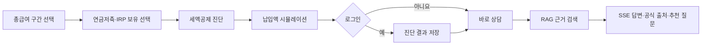
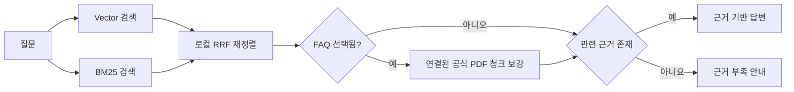

# 연금 연말정산 환급금 수색대

> 총급여와 연금계좌 납입 현황으로 예상 세액공제 효과를 계산하고,
> 공식 자료 기반 RAG 챗봇으로 다음 절세 질문까지 이어 주는 핀테크 MVP

프론트엔드에서는 **절세택시**라는 이름을 사용합니다. 세액공제 계산은 테스트 가능한
Python 서비스가 담당하고, LLM은 공식 자료 검색과 조건 설명에만 사용합니다.

## 한눈에 보기

> 코드 기준: 2026-08-05 `main` 커밋 `9593a03`

| 영역 | 현재 구현 |
| --- | --- |
| 진단 | 총급여, 연금저축, IRP 납입액 기반 결정론적 계산 |
| 시뮬레이터 | 납입액 조정, 계좌별 한도, 예상 세액공제 효과 |
| RAG | ChromaDB Vector + 한국어 BM25 + 로컬 RRF 재정렬 + FAQ 연결 공식 PDF 근거 |
| 챗봇 | SSE 스트리밍, 공식 출처, 추천 질문 3개 |
| 대화 이력 | SQLite 세션 목록·조회·삭제와 최근 대화 문맥 |
| 인증·저장 | 이메일/JWT 인증과 사용자별 최신 진단 결과 저장 |
| 품질 평가 | 검색 평가 9건, 답변 품질 평가 20건 |

현재 진단 화면은 총급여 구간과 연금저축·IRP 보유 여부를 입력받습니다. ISA는 RAG
상담 범위에는 포함되지만 결정론적 진단 API 입력에는 아직 연결되지 않았습니다.

## 사용자 흐름



로그인하지 않아도 진단과 챗봇을 이용할 수 있습니다. 진단 결과를 계정에 저장하려면
로그인이 필요합니다.

## 계산 기준

계산은 `app/services/tax_credit_service.py`에서 처리합니다.

| 현재 엔진의 총급여 구간 | 예상 공제 효과율 |
| --- | ---: |
| 1,500만 원 이하 | 0% |
| 1,500만 원 초과 ~ 5,500만 원 이하 | 16.5% |
| 5,500만 원 초과 | 13.2% |

- 연금저축 세액공제 대상 납입 한도: 연 600만 원
- IRP를 포함한 연금계좌 합산 한도: 연 900만 원
- 예상 세액공제액: `공제대상 납입액 × 예상 공제 효과율`
- 예상 환급액: `min(예상 세액공제액, 내부 추정 결정세액)`

`estimated_tax_liability`는 UI 시뮬레이션을 위한 내부 추정치입니다. 예상 세액공제액과
예상 환급액은 실제 신고 결과나 최종 환급액을 의미하지 않습니다.

## 지식 검색

지식베이스에는 가이드 1개, FAQ 59개와 국세청·국가법령정보센터·금융위원회의 검증된
공식 PDF가 포함됩니다. 각 FAQ는 답변을 뒷받침하는 PDF 청크 ID를 보유하고, 각 문서는
공식 출처명, URL, 기준일과 검증일을 관리합니다.



답변의 `[문서 n]` 인용은 같은 순번의 공식 출처 메타데이터와 연결됩니다. 같은 공식
출처의 검색 근거는 하나로 묶어 표시하고, 카드에 포인터를 올리거나 탭하면 근거 청크와
발췌를 확인할 수 있습니다. 검색 점수는 사용자에게 노출하지 않습니다. 검색 근거가
부족하면 답변 생성을 중단합니다.

## 기술 구성

| 영역 | 기술 |
| --- | --- |
| 프론트엔드 | Next.js 16, React 19, TypeScript, Tailwind CSS 4 |
| 백엔드 | Python, FastAPI, Pydantic, Uvicorn |
| 데이터 | SQLite, ChromaDB |
| 검색 | Vector + BM25 + 결정론적 RRF |
| LLM | OpenAI Responses/Chat Completions API |
| 인증 | JWT, bcrypt |

## 빠른 시작

### 백엔드

```powershell
python -m venv .venv
.\.venv\Scripts\Activate.ps1
python -m pip install -r requirements.txt
Copy-Item .env.example .env
python -m uvicorn app.main:app --reload
```

- API: <http://127.0.0.1:8000/>
- Swagger UI: <http://127.0.0.1:8000/docs>

RAG를 사용하려면 `.env`에 `OPENAI_API_KEY`와 개발용 `SECRET_KEY`를 설정하고
지식베이스를 수동으로 적재합니다.

```powershell
python scripts/index_tax_faq.py --strict-provenance
python scripts/index_pdf.py
python scripts/index_pdf.py --pdf app/data/pdfs/income_tax_act_20260701.pdf
python scripts/index_pdf.py --pdf app/data/pdfs/income_tax_decree_20260701.pdf
python scripts/index_pdf.py --pdf app/data/pdfs/special_tax_treatment_act_20260701.pdf
python scripts/index_pdf.py --pdf app/data/pdfs/retirement_benefits_act_20260701.pdf
python scripts/index_pdf.py --pdf app/data/pdfs/fsc_2025_pension_savings_white_paper.pdf
python scripts/index_pdf.py --pdf app/data/pdfs/fsc_2018_retirement_pension_risk_assets.pdf
python scripts/validate_faq_pdf_links.py
```

### 프론트엔드

새 PowerShell 터미널에서 실행합니다.

```powershell
Set-Location frontend
npm ci
$env:NEXT_PUBLIC_API_URL="http://127.0.0.1:8000"
npm run dev
```

- 웹 UI: <http://localhost:3000/>
- 진단: <http://localhost:3000/diagnose>
- 챗봇: <http://localhost:3000/chat>

## 진단과 챗봇의 역할

- 진단 화면은 사용자가 입력한 총급여와 연금계좌 납입액을 바탕으로 결정론적 계산 엔진이 예상 세액공제 효과를 계산합니다.
- 챗봇은 공식 근거에 따른 제도·요건·예외를 안내합니다. 개인별 공제액, 환급액, 한도 충족 여부를 계산하거나 추정하지 않으며, 이런 질문은 진단 화면으로 안내합니다.

## 문서 안내

| 문서 | 내용 |
| --- | --- |
| [API 가이드](docs/api.md) | 엔드포인트, 인증, 요청 예시, SSE, 데이터 저장 |
| [개발·검증 가이드](docs/development.md) | 환경 설정, 테스트, 프로젝트 구조, GitHub 현황 |
| [RAG 운영 문서](docs/rag.md) | 환경변수, 인덱싱, 비용·안전 제한 |
| [검색 평가](docs/retrieval-evaluation.md) | 고정 평가셋과 검색 성능 |
| [답변 품질 평가](docs/answer-quality-evaluation.md) | 근거 충실도·관련성·환각 평가 |

## 현재 검증 상태

- Python 테스트 79개 통과
- 프론트엔드 진단 시뮬레이터 테스트 3개 통과
- 2026-08-05 조회 시 열린 GitHub 이슈와 PR 없음

상세 결과와 최근 반영 내역은 [개발·검증 가이드](docs/development.md)를 참고하세요.

## 세법 기준 및 참고 자료

- [국세청 근로소득 안내 — 연금계좌 세액공제](https://j.nts.go.kr/nts/cm/cntnts/cntntsView.do?cntntsId=7875&mi=6596)
- [국세청 맞춤형 안내 — 월세액 세액공제](https://www.nts.go.kr/nts/cm/cntnts/cntntsView.do?cntntsId=239025&mi=40634)
- [국가법령정보센터 — 소득세법 제59조의3](https://law.go.kr/lsLinkCommonInfo.do?lsJoLnkSeq=1021863203)
- [국가법령정보센터 — 조세특례제한법 제95조의2](https://www.law.go.kr/lsLinkCommonInfo.do?chrClsCd=010202&lsJoLnkSeq=1026488335)

세법은 개정될 수 있으므로 계산 로직과 RAG 지식베이스에는 적용 기준일과 출처를 함께
관리합니다.

## 면책 안내

> 본 서비스는 입력한 총급여와 연금계좌 납입액, 공식 자료를 바탕으로 한 참고용
> 시뮬레이션입니다. 표시 금액은 예상치이며 실제 환급액을 보장하지 않습니다. 최종
> 적용 여부와 금액은 국세청 신고 결과 또는 세무 전문가의 확인을 따라야 합니다.
